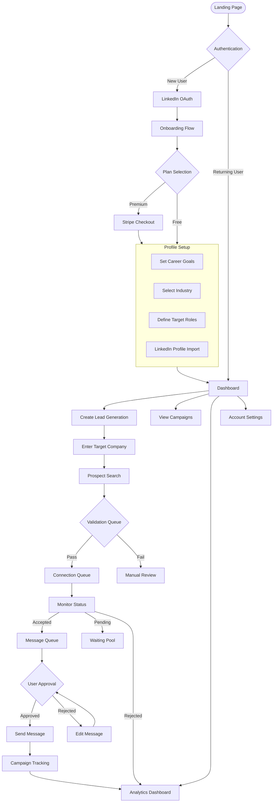

# AI-Powered Internship Lead Generator

A SaaS platform that helps students automate and optimize their internship outreach process using LinkedIn. The platform intelligently generates personalized connection requests and follow-up messages while maintaining a professional and authentic approach.

## 🚀 Features

### Authentication & Plans
- LinkedIn OAuth integration for seamless login
- Flexible pricing plans:
  - Free tier with basic features
  - Premium tier with advanced automation capabilities
- Secure Stripe integration for payment processing

### Profile Setup
- Guided onboarding experience
- Career goal definition
- Industry selection (Tech, Banking, Consulting, etc.)
- Role targeting
- Automated LinkedIn profile analysis

### Lead Generation
- Company-based prospect search
- Automated connection request management
- AI-powered message generation
- Campaign tracking and analytics

## 🔄 Detailed Application Workflow

### Key Workflow Steps

1. **User Onboarding**
   - Landing page entry
   - LinkedIn authentication
   - Plan selection
   - Profile setup

2. **Campaign Creation**
   - Company targeting
   - Prospect validation
   - Connection requests
   - Message generation and approval

3. **Monitoring & Analytics**
   - Campaign tracking
   - Success metrics
   - Performance analytics

## 💻 Dashboard Features

### Main View
- Campaign overview
- Connection statistics
- Message status
- Success metrics

### Campaign Controls
- Start/pause campaigns
- Review pending messages
- Track connection status
- View analytics

## ⚙️ Technical Implementation

### Backend Systems
- LinkedIn API integration
- Message generation engine
- Campaign scheduler
- Analytics processor

### Security Features
- Rate limiting
- LinkedIn compliance
- Data encryption
- User privacy controls

## 🔒 Privacy & Compliance

- GDPR/CCPA compliant
- Secure data handling
- LinkedIn automation policy adherence
- Regular security audits

## 📈 Analytics & Reporting

- Connection success rates
- Response metrics
- Campaign performance
- Engagement analytics

## 🛠️ Setup Instructions

[Coming Soon]

## 📝 API Documentation

[Coming Soon]

## 🤝 Contributing

[Coming Soon]

## 📄 License

[Type of License]

## BUGS

- Sign in sometimes doesn't scrape profile [In progress - Might be getting IP blocked] [X]
- Need to reload to see "View Message" [X]
- Implement Drag and Drop properly [X]
- Implement auto prospect validation [X]
- Test if other roles work (besides SWE) [X]
- Implement dashboard metrics/stats properly [X]
- Implement usage tracking and plan adherence
- Make every campaign find more leads [X]
- Remove Leads model from schema [X]
- Remove other redundant models/apis [X]
- Ensure settings pages work properly [X]
- Ensure upgrade plan works (webhook not currently used) [X]
- Add a confirm linkedin username (and note that this cannot be changed after) during sign up [x]

- Is automated billing setup? [X]
- Add more compliance things (ToS, payment w/ stripe, etc) [X]
- Optimize landing page for conversion (demo video) [X]
- Add rotating logins (.env) [X]
- Create Build
- Deploy

# PLANS
|     Free      |     Plus      |      Pro      |
| ------------- | ------------- | ------------- |
| $0            | $9/month      | $20/month     |
| 2 campaigns/month  | 20 campaigns/month  | Unlimited campaigns  |
| Up to 15 prospects per campaign  | Up to 50 prospects per campaign  | Up to 50 prospects per campaign  |
| Basic prospect validation  | Advanced prospect validation  | Advanced prospect validation  |
| Basic message personalization  | Advanced message personalization  | Advanced message personalization  |